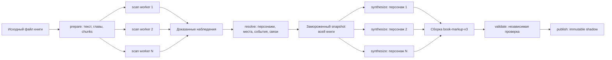

# Параллельный анализ книги: архитектура и эксплуатация

Этот документ описывает полный серверный контур разметки книги и формирования
персонажей: от исходного файла до изолированной `shadow`-публикации. Он является
спецификацией архитектуры, инвариантов доказательности и операторских процедур.

## 1. Версии и исходная точка разработки

Текущие версии контракта:

| Компонент | Версия | Назначение |
| --- | --- | --- |
| Pipeline | `book-analysis-v16` | Малые scan-фрагменты, адаптивный fallback, evidence-aware resolver и семантический контроль полноты |
| Scan prompt и extractor | `book-scan-v9` | Quote-only evidence с безопасным сопоставлением пробельной структуры исходника |
| Итоговая разметка | `book-markup-v3` | Доказательная схема книги и персонажей |
| Синтез профиля | `character-profile-v2` | Поэлементно проверенный профиль персонажа |
| Схема артефакта | `3` | Структура хранимой итоговой разметки |

Мобильный manifest использует опубликованную `book-markup-v3` как каноническую
разметку. Строки `book-markup-v2` сохраняются для истории и миграционных задач,
но не подменяют готовый или выполняющийся v3-анализ.

## 2. Цель и основные инварианты

Pipeline должен сформировать разметку и профили персонажей на основании всей
книги, не отправляя всю книгу модели одним запросом.

Обязательные инварианты:

1. Финальная разметка создаётся только после обработки всех частей книги.
2. Один scan-worker получает только ограниченный фрагмент, а не всю книгу.
3. Каждый факт в итоговой разметке связан с дословной цитатой и координатами в
   нормализованном тексте.
4. Выдуманная, изменённая или неоднозначно найденная цитата не записывается в
   поток доказательств.
5. Персонажи разрешаются по совокупности наблюдений всей книги, а не по одному
   фрагменту.
6. Факты книги отделены от творческих полей персонажа.
7. Стадии изолированы устойчивыми заданиями и могут масштабироваться независимо.
8. Непроверенный результат не публикуется даже в `shadow`.
9. Повторный запуск с теми же входом и версиями идемпотентен.
10. Изменение смысла промпта требует новой версии extractor и нового прогона.

## 3. Общий поток данных



Модель видит данные на двух стадиях:

- `scan` — один ограниченный фрагмент книги;
- `synthesize` — ограниченный набор уже доказанных наблюдений одного персонажа.

Стадия `resolve` работает со всеми наблюдениями книги, но детерминированно и без
LLM. Стадия `validate` также не использует LLM.

## 4. Стадии pipeline

### 4.1. `prepare`

Coordinator создаёт один идемпотентный run и одно задание `prepare`. Worker:

1. читает проверенный исходный объект книги;
2. сверяет размер и SHA-256 с неизменяемыми метаданными издания;
3. извлекает нормализованный текст и карту разделов;
4. сохраняет текст в
   `analysis/{runId}/normalized-text-v1.txt`;
5. строит детерминированные chunks;
6. в одной транзакции создаёт scan-задания и завершает барьер `prepare`.

Нормализованный текст сохраняется один раз. Scan-workers читают нужные байтовые
диапазоны из object storage и не загружают исходный EPUB целиком.

### 4.2. `scan`

Каждый scan-worker:

1. получает lease одного scan-задания;
2. читает только UTF-8 диапазон своего chunk;
3. проверяет длину и SHA-256 фрагмента;
4. отправляет `CONTEXT_TEXT` и `CORE_LOCAL_RANGE` внутреннему generation service;
5. принимает ответ модели и проверяет каждое наблюдение независимо;
6. переводит локальные UTF-16 координаты в абсолютные координаты книги;
7. записывает только доказанные наблюдения;
8. завершает своё задание в той же транзакции.

Последний завершённый scan-job под блокировкой run создаёт ровно одно задание
`resolve` и переводит run на следующую стадию.

### 4.3. `resolve`

Один resolve-job читает полный упорядоченный поток наблюдений книги. Resolver:

- объединяет одинаковые нормализованные имена;
- использует только явные высокоуверенные `character_alias` для связи разных
  имён;
- объединяет однозначную цепочку частей ФИО, когда фамильная форма ведёт ровно
  к одному наиболее полному имени;
- не выводит alias из одного имени: например, `Анна` и `Анна Сергеевна`
  остаются раздельными без явного доказательства;
- не объединяет алиас, который относится к нескольким персонажам;
- оставляет местоимения и известные описательные обозначения вроде «молодой
  человек» и «мещанин» кандидатами независимо от числа повторений;
- назначает каждое наблюдение одной сущности того же типа.

Результат и полный набор evidence IDs фиксируются в неизменяемом snapshot.
Именно этот snapshot является входом для всех последующих профилей.

### 4.4. `synthesize`

Для каждого подтверждённого персонажа создаётся отдельное задание. Такие задания
можно выполнять параллельно между книгами и персонажами.

Worker получает только evidence этого персонажа. Детерминированный selector
ограничивает размер запроса, но сохраняет:

- наблюдения из начала, середины и конца книги;
- все доступные типы фактов;
- ссылки на исходные evidence IDs.

После всех профилей становится доступно зависимое book assembly-задание. Оно без
нового запроса всей книги объединяет персонажей, места, события и связи из одного
snapshot в `book-markup-v3`.

Версия `character-profile-v2` проверяет каждый claim независимо. Неизвестный
evidence ID, сломанная структура или несовместимый тип отбрасывают только один
claim. Например, `traits` разрешено подтверждать только наблюдениями
`character_trait`, а не `character_action`. Остальные доказанные поля профиля и
creative-данные сохраняются. Верхнеуровневый не-JSON ответ по-прежнему отклоняет
весь запрос и не попадает в кэш.

### 4.5. `validate`

Независимый validator повторно читает нормализованный текст и проверяет:

- SHA-256 текста;
- дословность каждой цитаты и её координаты;
- принадлежность evidence замороженному snapshot;
- принадлежность фактов своим сущностям;
- совместимость типа факта с полем профиля;
- ссылки между объектами итоговой разметки;
- версию и схему артефакта.

Невалидный артефакт завершает run ошибкой и не создаёт publish-задание.

### 4.6. `publish`

Publish-worker принимает только артефакт с валидным, криптографически связанным
отчётом проверки. Он атомарно создаёт неизменяемую публикацию с каналом
`shadow`.

`shadow` не обновляет `book_markups` v2 и не становится видимым читателям.
Продвижение v3 в публичный контракт является отдельным продуктовым решением.

## 5. Нарезка книги: core и overlap

Параметры по умолчанию:

| Параметр | Значение | Назначение |
| --- | ---: | --- |
| `targetChars` | 14 000 | Предпочтительная длина core |
| `minChars` | 8 000 | Минимальная длина core |
| `maxChars` | 18 000 | Максимальная длина core |
| `overlapChars` | 1 800 | Контекст слева и справа |

Core-диапазоны покрывают нормализованный текст целиком и без пересечений.
Context-диапазоны пересекаются, чтобы модель понимала начало и продолжение сцены.

Для каждого chunk хранятся одновременно:

- абсолютные UTF-16 координаты core и context;
- точные UTF-8 byte ranges для object storage;
- SHA-256 контекстного текста;
- связанные главы и их названия.

Модель обязана извлекать факты только тогда, когда начало evidence находится
внутри `CORE_LOCAL_RANGE`. Overlap разрешено использовать только как контекст.
Worker повторно применяет это правило серверно, поэтому соседние chunks не
владеют одним и тем же фактом.

## 6. Доказательная валидация `book-scan-v9`

### 6.1. Контракт ответа модели

Модель возвращает не профиль персонажа, а массив атомарных наблюдений:

```json
{
  "observations": [
    {
      "type": "character_action",
      "entityKind": "character",
      "entityCandidate": "имя персонажа",
      "relatedEntityCandidates": [],
      "fact": "краткий факт без домыслов",
      "evidence": {
        "quote": "дословная непрерывная цитата"
      },
      "confidence": 0.95
    }
  ]
}
```

Модель не вычисляет координаты. Она обязана выбрать дословную цитату достаточной
длины, которая встречается внутри core ровно один раз. Сервер сам находит её
локальные UTF-16 offsets и затем переводит их в абсолютные координаты книги.

### 6.2. Проверка одного наблюдения

Каждое наблюдение проходит проверку независимо:

1. Проверяется закрытая схема полей, тип сущности и диапазон confidence.
2. В source и `quote` только непрерывные серии whitespace сворачиваются в один
   пробел; слова и пунктуация остаются без изменений.
3. Выполняется точный посимвольный поиск всех вхождений нормализованной цитаты.
4. Из найденных вхождений учитываются только те, начало которых находится в core.
5. Если внутри core осталось ровно одно вхождение, сервер восстанавливает точный
   source substring и вычисляет координаты.
6. Если цитата отсутствует или неоднозначна внутри core, наблюдение
   отбрасывается.
7. Если начало доказательства находится вне core, наблюдение отбрасывается как
   принадлежащее overlap.
8. В БД передаются только оставшиеся наблюдения.

Это не полнотекстовый, нечёткий или векторный поиск. Пересказ и похожая фраза не
считаются доказательством.

### 6.3. Частично валидный ответ

Ответ модели может содержать одновременно корректные и выдуманные цитаты.
`book-scan-v9` сохраняет доказанные элементы и отбрасывает только проблемные.
Один плохой элемент больше не уничтожает остальные валидные факты и не заставляет
повторять весь дорогой запрос.

Дополнительно v5 не принимает имя автора с титульной страницы как персонажа.
Наблюдение `relationship` разрешено только для отношений между персонажами.
Если модель не продублировала участника отдельным `character_*`-наблюдением,
сервер создаёт для него доказательное `character_mention` на той же цитате.
Так отношение не теряется и персонаж не остаётся только строкой внутри связи.

Если после фильтрации не осталось ни одного наблюдения, запрос считается
`EVIDENCE_MISMATCH`:

- scan-job возвращается в очередь с backoff;
- результат не кэшируется;
- на последней попытке scan-worker фиксирует для этого chunk доказанный пустой
  результат и пропускает его через барьер;
- событие `scan.empty_completed` содержит только run/job, число попыток и
  следующую стадию, без текста книги.

Такой fallback разрешён только для `EVIDENCE_MISMATCH`: chunk был прочитан и
provider ответил, но ни один элемент не выдержал строгую evidence-проверку.
Ошибки транспорта, схемы, checksum, диапазона или версии по-прежнему завершают
run после исчерпания попыток. Пустой chunk снижает полноту, но не добавляет в
разметку выдуманные сведения и не блокирует обработку остальных частей книги.

Верхнеуровневые ошибки ответа — отсутствие JSON-объекта, отсутствие массива
`observations` или более 160 элементов — также не кэшируются.

## 7. Версии, идемпотентность и кэш

Уникальность run связывает:

```text
bookEditionId + inputHash + pipelineVersion + promptVersion
```

Ключ scan-запроса связывает:

```text
runId + "scan" + chunkId + extractorVersion
```

Кэш generation service хранит одновременно hash запроса и результат. Повторное
использование ключа с другим телом отклоняется как `IDEMPOTENCY_CONFLICT`.

Правила изменения версии:

1. Любое смысловое изменение scan-промпта или нормализации требует новой версии
   `BOOK_ANALYSIS_PROMPT_VERSION` и `BOOK_ANALYSIS_EXTRACTOR_VERSION`.
2. Обе константы должны быть равны.
3. Новая версия создаёт новый run и новые cache keys.
4. Старый активный run нельзя продолжать worker другой версии.
5. Изменение только реализации без изменения результата может не повышать
   версию, но это решение должно быть явно зафиксировано в review.

Переходы в этой серии:

- `book-scan-v2` — первоначальный scan; модель концентрировалась на overlap;
- `book-scan-v3` — явный `CORE_LOCAL_RANGE` и просмотр всего core;
- `book-scan-v4` — поэлементная доказательная фильтрация смешанного ответа;
- `book-scan-v5` — исключение автора из front matter и обязательная фиксация
  каждого персонажа, участвующего в `relationship`;
- `book-scan-v6` — повтор фрагмента, если при пяти и более исходных наблюдениях
  точную evidence-проверку прошла доля меньше 25%;
- `book-scan-v7` — модель возвращает только точную цитату, а сервер определяет
  координаты внутри core и различает безопасные причины отклонения;
- `book-scan-v8` — при семантическом отказе только проблемный core делится на
  две части с overlap; участники доказанного отношения материализуются сервером;
- `book-scan-v9` — переносы строк и серии пробелов сопоставляются как один
  пробел, после чего evidence сохраняется в точном виде исходного текста.

## 8. Изоляция данных

Таблицы `book_analysis_*` образуют отдельный control plane:

| Таблица | Назначение |
| --- | --- |
| `book_analysis_runs` | Один версионированный прогон книги |
| `book_analysis_chunks` | Неизменяемые core/context границы |
| `book_analysis_jobs` | Очередь, lease, attempts и shard каждой стадии |
| `book_analysis_observations` | Append-only поток доказанных фактов |
| `book_analysis_entities` | Разрешённые персонажи и другие сущности |
| `book_analysis_entity_evidence` | Связь сущностей с наблюдениями |
| `book_analysis_snapshots` | Замороженный вход синтеза |
| `book_analysis_artifacts` | Профили, разметка и отчёты проверки |
| `book_analysis_publications` | Неизменяемые `shadow`-ревизии |

Observation rows неизменяемы. Триггер запрещает добавлять их вне активного
scan-job. Уникальность включает run, chunk, extractor version и observation key,
поэтому повтор lease не создаёт дубликаты.

## 9. Задания, lease, повторы и барьеры

Workers получают задания через `FOR UPDATE SKIP LOCKED`. Это позволяет нескольким
репликам одной стадии брать разные shards без центрального диспетчера.

Текущие значения по умолчанию:

- lease: 300 секунд;
- heartbeat lease: каждые 60 секунд;
- polling: раз в 1 секунду;
- максимум попыток job: 5;
- backoff: экспоненциальный, но не более 300 секунд.

Если worker исчез, истёкший lease может забрать другая реплика. Если лимит
попыток исчерпан, job и run становятся `failed`.

Run может перейти на следующую стадию только если:

- у текущей стадии есть хотя бы одно required-задание;
- все required-задания текущей стадии имеют статус `ready`;
- переход выполняется ровно на одну стадию вперёд.

Статусы `ready` и `cancelled` терминальны и неизменяемы. `failed` можно вернуть в
`queued` только осознанной операторской процедурой после устранения причины.

## 10. Параллелизм и масштабирование

Compose profile `book-analysis-shadow` выключен по умолчанию и содержит отдельный
service для каждой стадии:

| Service | Типичная репликация | Ограничение |
| --- | ---: | --- |
| `book-analysis-prepare` | 1 | Один job на книгу |
| `book-analysis-scan` | 2–N | Независимые chunks |
| `book-analysis-resolve` | 1 | Один полный evidence set книги |
| `book-analysis-synthesize` | 2–N | Независимые персонажи |
| `book-analysis-validate` | 1 | Один итоговый артефакт |
| `book-analysis-publish` | 1 | Одна атомарная публикация |

Реплики можно менять без изменения схемы или публичного API. Общая фактическая
параллельность дополнительно ограничена gateway concurrency gate и лимитами
LLM-провайдера.

Рекомендуемый безопасный запуск нового релиза:

1. `prepare=1`, `scan=1`, остальные workers остановлены.
2. Проверить первый готовый scan-job: число фактов, распределение offsets и
   отсутствие terminal errors.
3. Поднять `scan` до 2–3 реплик.
4. Запустить `resolve=1`, `synthesize=2–3`, `validate=1`, `publish=1`.
5. Не увеличивать replicas только ради скорости, если растут rate limits или
   ошибки provider response.

## 11. Контракты с мобильным приложением

Текущий shadow pipeline не меняет контракты Android/Expo и публичные маршруты
gateway. Мобильное приложение продолжает получать v2 markup.

`book-markup-v3` разделяет:

- `grounded` — роль, возраст, пол, характер, внешность, речь и другие факты с
  evidence IDs и confidence;
- `creative` — приветствие, prompt портрета и выбор голоса.

Creative-поля создаются на основе профиля, но никогда не выдаются за цитируемые
факты книги.

## 12. Наблюдаемость и безопасные логи

Логи не содержат текст книги, prompts, цитаты, токены или ответы модели.

Для каждого успешного scan-запроса пишутся счётчики:

- `provider_observation_count` — сколько элементов вернула модель;
- `accepted_observation_count` — сколько прошло доказательную проверку;
- `repaired_observation_count` — скольким восстановлены точные координаты;
- `dropped_observation_count` — сколько отброшено.

Если не принято ничего, событие `scan.llm_rejected` содержит те же счётчики.
Успешный запрос пишет `scan.llm_completed`. Worker отдельно пишет
`scan.completed` или `scan.failed` с безопасным error code.

Для успешного профиля `synthesis.character_completed` содержит аналогичные
счётчики `provider_claim_count`, `accepted_claim_count` и
`dropped_claim_count`. Значения claims и evidence IDs в лог не записываются.

Ключевые метрики качества shadow-прогона:

- доля scan-jobs, завершившихся с первой попытки;
- доля отброшенных наблюдений;
- число наблюдений и уникальных кандидатов на chunk;
- распределение evidence offsets внутри core;
- число подтверждённых и candidate-персонажей;
- заполненность доказательных полей профилей;
- ошибки независимого validator;
- отсутствие публикаций в v2.

Высокая доля `dropped_observation_count` не нарушает доказательность, но указывает
на снижение полноты и требует анализа prompt/model до публичного продвижения.

## 13. Операторский runbook

### 13.1. Создание и просмотр run

```bash
docker compose exec gateway npm run book-analysis -- \
  start --book-edition-id <book-edition-uuid>

docker compose exec gateway npm run book-analysis -- \
  status --run-id <analysis-run-uuid>

docker compose exec gateway npm run book-analysis -- \
  result --run-id <analysis-run-uuid>
```

`start` только создаёт идемпотентный run. Само наличие запущенных workers не
ставит книги в очередь.

### 13.2. Запуск workers

```bash
docker compose --profile book-analysis-shadow up -d \
  --scale book-analysis-prepare=1 \
  --scale book-analysis-scan=2 \
  --scale book-analysis-resolve=1 \
  --scale book-analysis-synthesize=2 \
  --scale book-analysis-validate=1 \
  --scale book-analysis-publish=1
```

### 13.3. Остановка без потери прогресса

```bash
docker compose stop \
  book-analysis-prepare \
  book-analysis-scan \
  book-analysis-resolve \
  book-analysis-synthesize \
  book-analysis-validate \
  book-analysis-publish
```

Готовые jobs и observations сохраняются. Running-jobs после истечения lease
можно забрать повторно. Gateway, legacy worker, PostgreSQL и object storage для
этого останавливать не требуется.

### 13.4. Смена prompt/extractor version

Порядок обязателен:

1. Остановить все shadow-workers.
2. Развернуть один и тот же новый immutable image на gateway и workers.
3. Пометить старые активные runs `cancelled`; не удалять диагностические данные.
4. Создать новый run той же книги — новая prompt version изменит idempotency key.
5. Запустить prepare и один scan-worker как canary.
6. После проверки масштабировать остальные стадии.

Старые активные runs нельзя оставлять рядом с workers новой extractor version:
новый worker может подобрать старый job, получить
`EXTRACTOR_VERSION_MISMATCH` и напрасно израсходовать attempts.

Текущая CLI не содержит команды cancel. До её появления отмена выполняется
только после остановки workers, одной транзакцией и с точным `run_id`:

```sql
BEGIN;

UPDATE book_analysis_jobs
SET status = 'cancelled',
    locked_at = NULL,
    lease_expires_at = NULL,
    locked_by = NULL,
    lease_token = NULL,
    updated_at = now()
WHERE run_id = '<run-uuid>'::uuid
  AND status IN ('queued', 'running', 'failed');

UPDATE book_analysis_runs
SET status = 'cancelled',
    last_error_code = 'SUPERSEDED_PROMPT_VERSION'
WHERE id = '<run-uuid>'::uuid
  AND status IN ('queued', 'running', 'failed');

COMMIT;
```

### 13.5. Сброс попыток после инфраструктурной ошибки

Attempts можно обнулить только для одного известного run и одного доказанного
инфраструктурного error code, например ошибки несовместимой настройки модели.
Нельзя массово обнулять ошибки доказательности или validator: это скрывает дефект
качества, а не исправляет его.

Перед операцией workers должны быть остановлены. После неё сначала запускается
одна canary-реплика.

## 14. Проверка качества перед публикацией

Минимальные критерии завершённого shadow-прогона:

1. Все required jobs имеют статус `ready`.
2. Run завершён на `publish/ready` без ручного пропуска стадий.
3. Независимый validation report валиден.
4. В v2-таблицах и публичном manifest нет изменений от shadow-run.
5. Главные персонажи книги присутствуют и имеют доказательства из разных частей.
6. Характер, роль, внешность и речь не заполнены без совместимых типов evidence.
7. Evidence quotes дословно совпадают с нормализованным текстом.
8. Случайная выборка персонажей и фактов проверена человеком по книге.
9. Оценена полнота: низкая доля принятых наблюдений не маскируется техническим
   успехом pipeline.
10. Зафиксированы версия image, run ID, input hash, prompt version и итоговые
    счётчики.

## 15. Отказы и ожидаемая реакция

| Ошибка | Реакция |
| --- | --- |
| Неверный checksum книги/chunk | Job retry, публикации нет |
| Provider HTTP/rate/timeout | Job retry с backoff |
| Невалидный JSON верхнего уровня | Job retry, кэш не создаётся |
| Часть наблюдений без доказательств | Плохие элементы отбрасываются |
| Ни одного доказанного наблюдения | Retry; на последней попытке пустой grounded chunk |
| Истёкший lease | Другой worker повторно забирает job |
| Несовпадение extractor version | Job не выполняется; нужен правильный image/run |
| Resolve не может однозначно объединить имя | Сущности остаются раздельными кандидатами |
| Невалидный итоговый артефакт | Run failed до publish |
| Worker остановлен | Данные сохраняются, lease восстанавливается |

## 16. Безопасность и приватность

- Токен internal generation service не совпадает с installation token.
- Provider credentials остаются только на gateway.
- Resolve и publish workers не получают provider или storage credentials.
- Scan worker читает только свой byte range.
- В модель не отправляется source object key или вся нормализованная книга.
- Текст книги, цитаты и ответы модели не пишутся в operational logs.
- Runtime workers read-only, без Linux capabilities и с
  `no-new-privileges`.

Для catalog-книг нормализованный текст хранится серверно в закрытом object
storage. Контур локальных пользовательских книг и его правила хранения остаются
отдельными и не должны автоматически переводиться на полный server-side scan.

## 17. Тестирование

Обязательные группы проверок:

- unit: chunks, UTF-8/UTF-16 границы и детерминированные IDs;
- unit: точные, восстановленные, неоднозначные и отсутствующие цитаты;
- unit: смешанный ответ сохраняет валидные и отбрасывает плохие элементы;
- unit: полностью неподтверждённый ответ не кэшируется;
- unit: смешанный профиль сохраняет совместимые claims и отбрасывает только
  сломанные, неизвестные или несовместимые;
- unit: однозначные части ФИО объединяются, неоднозначные и описательные
  кандидаты остаются раздельными;
- unit: prompt явно ограничивает владение `CORE_LOCAL_RANGE`;
- unit: prompt/extractor versions совпадают;
- repository: leases, `SKIP LOCKED`, attempts и барьеры;
- integration PostgreSQL: конкурирующие scan-workers и полный путь до shadow;
- deployment contract: каждая стадия — отдельный масштабируемый service;
- shadow E2E: реальная книга, ручная проверка главных персонажей и фактов.

## 18. Известные ограничения

- Точная доказательность не гарантирует полноту: модель может пропустить факт.
- Уникальное восстановление координат невозможно для повторяющейся цитаты с
  неверными offsets; такое наблюдение отбрасывается.
- Поэлементная фильтрация сохраняет доказанные данные, но высокий процент
  отброшенных элементов требует улучшения prompt/model.
- Классификация описательных обозначений основана на форме фразы и конечном
  словаре родственных ролей; неизвестная роль всё ещё требует shadow-контроля.
- Автоматическое объединение частей ФИО не использует общий морфологический
  анализ. Разговорные отчества объединяются только при одинаковых имени и
  фамилии, а nickname-мост требует взаимных mention-связей и составной формы.
- Один resolve-job на книгу ограничивает параллелизм этой стадии, но сохраняет
  целостность решения об идентичности персонажей.
- В операторской CLI пока нет cancel/retry команд для analysis runs.
- `shadow` не заменяет продуктовую оценку и ручную проверку качества персонажей.

Эти ограничения должны оцениваться по метрикам и shadow-прогонам до любого
изменения публичного контракта.

## 19. Контрольный shadow-прогон `book-scan-v4`

Контрольный прогон выполнен на тестовом стенде 13 августа 2026 года по книге
«Преступление и наказание». Он не затрагивал production и не создал публикацию
для мобильного приложения.

Идентификаторы прогона:

| Поле | Значение |
| --- | --- |
| Commit | `2a0b8236` |
| Image | `readany/narra-gateway:grounded-scan-v4-2a0b8236-20260813T000000Z` |
| Run ID | `5a64c9a9-71c9-482e-916a-abc16c4e62b6` |
| Book edition | `bef16434-1e57-4088-a9e0-aa3883797e1f` |
| Pipeline | `book-analysis-v3` |
| Prompt/extractor | `book-scan-v4` |
| Нормализованный текст | 1 076 293 UTF-16 code units |
| Chunks | 77 |

### 19.1. Результат scan

| Метрика | Значение |
| --- | ---: |
| LLM-вызовы scan | 98 |
| Успешные ответы с принятыми фактами | 77 |
| Полностью отклонённые ответы | 21 |
| Элементы, возвращённые моделью | 1 410 |
| Принятые доказанные наблюдения | 416 |
| Наблюдения с восстановленными координатами | 414 |
| Отброшенные элементы | 994 |

Все 77 scan-jobs завершились: 55 с первой попытки, 15 со второй, 6 с третьей и
1 с четвёртой. Ни один недоказанный элемент не был записан. Высокая доля
отброшенных элементов показывает, что текущая модель часто возвращает
перефразированные или отсутствующие цитаты; v4 сохраняет корректность ценой
полноты и дополнительных вызовов.

### 19.2. Результат resolve

Resolver создал:

| Тип сущности | Подтверждено |
| --- | ---: |
| Персонажи | 52 |
| События | 38 |
| Места | 16 |
| Отношения | 22 |

Проверка первых персонажей обнаружила отдельные сущности `Раскольников`,
`Родион Раскольников`, `Родион Романович Раскольников` и аналогичные варианты
имени Авдотьи. Также отдельными подтверждёнными персонажами стали описательные
обозначения вроде «молодой человек». Это не ошибка evidence-фильтра, а
ограничение текущего детерминированного resolver.

### 19.3. Результат synthesize и публикация

46 профилей персонажей были сформированы успешно. Один профиль исчерпал пять
попыток и завершился `GENERATOR_HTTP_400`; безопасная изолированная диагностика
установила внутреннюю причину:

```text
GENERATION_RESULT_INVALID: profile claim uses incompatible evidence type
```

После этого run корректно перешёл в `synthesize/failed`. Зависимая сборка книги,
`validate` и `publish` не выполнялись, shadow-публикация не создана. Attempts не
сбрасывались вручную, поэтому диагностическое состояние сохранено.

Контрольный прогон подтверждает работоспособность параллельного полного scan и
поэлементной доказательной фильтрации. Он одновременно показывает, что до
следующего E2E-прогона необходимы две отдельные согласованные доработки:

1. поэлементная фильтрация claims в профиле персонажа с новой synthesis/pipeline
   version;
2. консервативное объединение однозначных вариантов имени и исключение
   описательных кандидатов из обязательного синтеза.

Обе доработки реализованы после этого исторического прогона в
`book-analysis-v6` / `character-profile-v2`; их результат должен быть
подтверждён новым чистым shadow-run.

## 20. Успешный E2E-прогон `book-analysis-v5`

После исправления profile claims и политики пустого scan выполнен новый чистый
прогон той же книги. Он использовал пять scan-workers и до пяти synthesize-
workers; число реплик менялось во время run без его перезапуска.

| Поле | Значение |
| --- | --- |
| Commit | `12b3f200` |
| Image | `readany/narra-gateway:book-analysis-v5-amd64-12b3f200-20260813T100000Z` |
| Run ID | `acd4c9b3-fc4f-4de6-b45f-c5c4e81aa7ea` |
| Pipeline | `book-analysis-v5` |
| Prompt/extractor | `book-scan-v4` |
| Chunks | 77 |
| Доказанные наблюдения | 399 |
| Shadow publication | `806e287a-b29f-49ac-9023-9342eb190111` |
| Content hash | `238df65a8a7db0f73c65198a44da7c64b655ea8a8f67351f541cf12b0a35e0cb` |

Scan завершился без failed jobs: 57 chunks с первой попытки, 15 со второй, два
с третьей, два с четвёртой и один с пятой. Последний chunk пять раз вернул
`EVIDENCE_MISMATCH`, после чего был безопасно завершён с нулём наблюдений;
событие `scan.empty_completed` зафиксировало fallback без текста книги.

Resolver создал 37 подтверждённых и 12 кандидатных персонажей. Все 38
synthesize jobs, независимая валидация и shadow-публикация завершились с первой
попытки. Ошибка несовместимого profile claim из предыдущего прогона не
повторилась.

Ручная проверка успешной публикации обнаружила остаточные качественные проблемы:
описательные сущности с заглавной буквы попадали в подтверждённые персонажи, а
варианты имени Авдотьи и Лебезятникова оставались раздельными. Поэтому v5
подтвердил полный E2E и масштабируемость, но не был признан итоговой версией
resolver. Эти случаи закрываются правилами `book-analysis-v6` и отдельными
регрессионными тестами; v6 требует нового shadow-прогона перед продуктовым
решением.

## 21. E2E-прогон `book-analysis-v6`

`book-analysis-v6` проверен отдельным чистым run на той же книге и пяти
параллельных scan/synthesize workers.

| Поле | Значение |
| --- | --- |
| Commit | `eb46f7b1` |
| Run ID | `a7729f6e-d416-4854-b6b9-573ffd6a5f4f` |
| Chunks | 77 |
| Доказанные наблюдения | 374 |
| Подтверждённые персонажи | 31 |
| Кандидаты персонажей | 20 |
| Shadow publication | `0363ef0f-4081-4fc8-bf70-77df6c2a5cde` |
| Content hash | `dffd64683aa960616f321c579140dae869da15e9714c76451fc654c616e51be7` |

Все стадии завершились успешно: 77 scan jobs, 32 synthesize jobs, validate и
publish имеют статус `ready`. Scan занял 55 первых, 16 вторых, пять третьих и
одну пятую попытку; последний chunk на пятой попытке вернул три доказанных
наблюдения, поэтому пустой fallback не потребовался. Весь run занял около 13
минут.

Ручная проверка подтвердила, что описательные сущности не попали в подтверждённые
персонажи, а варианты Лебезятникова объединились. При этом недетерминированный
scan не вернул взаимный alias-мост для Дуни: `Авдотья Романовна Раскольникова`,
`Авдотья Романовна Дуня` и `Дуня` остались тремя группами. В
`book-analysis-v7` добавлен ограниченный русский nickname-мост: он требует
составную форму `имя + отчество + nickname`, отдельно наблюдаемые префикс и
nickname и запрещает фамильные окончания. Обычные ФИО и взаимные упоминания без
составного моста не объединяются. v7 должен пройти server-side dry-run на 374
наблюдениях и новый shadow E2E до продуктового решения.

## 22. E2E-прогон `book-analysis-v7` и ограниченный `v8`

`book-analysis-v7` прошёл чистый shadow-run на полной книге с пятью scan и пятью
synthesize workers.

| Поле | Значение |
| --- | --- |
| Commit | `ffc5a77f` |
| Run ID | `6995e847-171f-4420-a75f-8199c0e48b9a` |
| Chunks | 77 |
| Доказанные наблюдения | 397 |
| Подтверждённые персонажи | 30 |
| Кандидаты персонажей | 16 |
| Shadow publication | `3c9dbd9f-098c-43a6-85ae-1e76911a2939` |
| Content hash | `cab2e903176d7f2b2b875898456a7b751a66d93e1021583217e58279690cdb1d` |
| Длительность | 11 минут 19 секунд |

Все 77 chunks завершились: 66 с первой, девять со второй и два с четвёртой
попытки. Resolve, 31 synthesize jobs, validate и shadow publish завершились с
первой попытки. Независимый validator подтвердил schema, source hash, evidence
и references. Все 30 профилей имеют identity evidence; 116 фактических claims
ссылаются на evidence, claims без evidence нет.

Аудит выявил три ложных разделения идентичности: `Дуня`/`Дунечка`,
`Соня`/`Сонечка` и одно ФИО с теми же тремя токенами в другом порядке. В
`book-analysis-v8` добавлены только два детерминированных правила: точная
русская форма `…я` ↔ `…ечка` для однословных имён и совпадение полного набора
трёх различных токенов ФИО независимо от порядка. Двухчастные имена, частичные
пересечения и другие уменьшительные формы автоматически не объединяются.

Server-side dry-run `v8` на всех 397 наблюдениях не выполнял LLM-запросов и
сократил число подтверждённых персонажей с 30 до 26. Получилось по одной группе
для Дуни, Сони и Родиона Раскольникова; после объединения переставленных ФИО к
Раскольникову также однозначно присоединилась ранее отделённая двухсловная
форма. Две разные сущности с фамилией Свидригайлов остались раздельными,
Лебезятников остался одной группой, подтверждённых описательных персонажей нет.

## 23. Финальный E2E-прогон `book-analysis-v8`

Финальный `book-analysis-v8` run выполнен на полной книге с теми же пятью scan и
пятью synthesize workers. После приёмки временные shadow-workers остановлены.

| Поле | Значение |
| --- | --- |
| Commit | `77be909f` |
| Run ID | `d1cdfaf1-0324-4466-b582-bc2a20da12c7` |
| Chunks | 77 |
| Доказанные наблюдения | 378 |
| Подтверждённые персонажи | 31 |
| Кандидаты персонажей | 20 |
| Shadow publication | `e97f7a5d-e071-47d7-a881-63b3d96f33fb` |
| Content hash | `d48e135eae332238530634f7267b29f410f970da2081134d49a1a0f8761d8a2e` |
| Длительность | 12 минут 42 секунды |

Все chunks завершились: 60 с первой, девять со второй, четыре с третьей, три с
четвёртой и один с пятой попытки. Пустой fallback не потребовался. Resolve, 32
synthesize jobs, validate и shadow publish завершились с первой попытки.
Validator подтвердил schema, source hash, evidence и references без ошибок. Все
31 профиля имеют identity evidence; опубликовано 99 фактических claims, claims
без evidence нет, описательных профилей нет.

В новом недетерминированном наборе наблюдений Дуня, Родион Раскольников и
Лебезятников образовали по одной группе. Соня и полное имя Софьи остались двумя
группами: этот scan не извлёк `Сонечка`, а resolver намеренно не использует
общеизвестное, но недоказанное соответствие `Соня` ↔ `Софья`. Это известное
ограничение принято вместо рискованного глобального словаря имён.

Дополнительный семантический аудит стратифицированной выборки из 24 claims той
же моделью `gpt-5.6-luna` дал 19 `entailed`, пять `insufficient` и ноль
`contradicted`. Недостаточно доказанные элементы встретились в трёх `role`,
одном `age` и одном `description`; проверенные appearance, speech style и traits
получили `entailed`. Это полезный приёмочный сигнал, но не независимая внешняя
оценка, поскольку генератор и judge используют одну модель.

## 24. `book-analysis-v9`: ограничение размера и quality gate

Аудит «Медного всадника» выявил успешную, но неполную v8-публикацию: один
scan-запрос получил все 15 805 символов, однако вернул только три наблюдения из
первых 331 символа и ни одного персонажа. Проверки schema/evidence/references
подтвердили внутреннюю корректность этих фактов, но не полноту анализа.

В v9 значения chunking по умолчанию изменены на `target=4000`, `min=2500`,
`max=5000`, `overlap=500`. Дополнительно resolve и PostgreSQL repository
отклоняют snapshot, если доказательства покрывают меньше 75% фиксированных
4 000-символьных полос или отсутствует подтверждённый персонаж. Такой run
завершается ошибкой и не заменяет ранее опубликованную разметку.

## 25. `book-analysis-v10`: семантический quality gate

Контрольный v9-прогон «Медного всадника» подтвердил покрытие всех четырёх
фрагментов, но выявил два более узких дефекта: имя автора с титульной страницы
стало персонажем, а Параша присутствовала только как участник отношения и не
получила собственного профиля.

В v10 prompt/extractor `book-scan-v5` фильтрует author-only front matter и
требует отдельное `character_*`-наблюдение для каждого участника отношения.
Resolve и PostgreSQL repository независимо повторяют эти проверки перед
фиксацией snapshot. Новая успешная публикация также возвращает ранее упавшие
медиапакеты её персонажей в очередь; обычное чтение manifest само по себе не
создаёт бесконечных повторов.

## 26. `book-analysis-v11`: контроль потери evidence

Контрольный v10-run показал ещё один измеримый класс неполноты: модель могла
вернуть 14–23 наблюдения для фрагмента, но после строгой проверки цитат в БД
оставалось одно. Пространственное покрытие книги при этом формально сохранялось.

`book-scan-v6` отклоняет такой слишком потерянный ответ: если provider вернул не
меньше пяти наблюдений, а принято меньше 25%, scan-job выполняется повторно и
результат не попадает в кэш. Единичные ошибки в смешанном ответе по-прежнему
отбрасываются поэлементно без ненужного повтора всего фрагмента.

## 27. `book-analysis-v12`: координаты evidence определяет сервер

Контрольные v11-runs «Медного всадника» показали, что требование вычислять
UTF-16 offsets перегружает модель и превращает часть содержательно полезных
ответов в `EVIDENCE_MISMATCH`. В `book-scan-v7` модель возвращает только
дословную цитату. Сервер ищет её внутри core: повтор той же цитаты в соседнем
overlap больше не создаёт ложную неоднозначность.

Безопасные семантические коды, включая
`SCAN_RELATION_PARTICIPANT_MISSING`, сохраняются между generation service и
scan-worker вместо общего `GENERATOR_HTTP_400`. Текст книги и сырой ответ модели
в operational logs по-прежнему не записываются.

## 28. `book-analysis-v13`: адаптивный scan fallback

Контрольный v12-run «Медного всадника» сохранил 15 наблюдений первого chunk,
но три других chunk исчерпали попытки: `EVIDENCE_MISMATCH` и отсутствие
отдельных character-наблюдений для участников отношений. Простое удаление
координат из ответа модели оказалось полезным, но недостаточным.

В `book-scan-v8` только семантически отклонённый core автоматически делится на
две близкие по размеру части по границе абзаца или предложения. Каждая часть
получает до 500 символов overlap, анализируется и кэшируется независимо, после
чего сервер переводит её evidence offsets обратно в координаты исходного chunk.
Глубина fallback ограничена одним делением: транспортные и инфраструктурные
ошибки дробление не запускают.

Для валидного `relationship` недостающие участники становятся серверными
`character_mention` с той же точной цитатой и confidence. Это заменяет хрупкое
требование, чтобы модель дублировала один смысл двумя объектами JSON, сохраняя
доказательность и последующую проверку resolver.

## 29. `book-analysis-v14`: безопасное восстановление стихотворных цитат

Контрольный v13-run подтвердил срабатывание adaptive split, но части по
2 400–3 000 символов всё равно теряли большинство наблюдений. Диагностика
показала соотношения 35→5, 22→1 и 37→0. Для стихотворного текста модель часто
сворачивает переносы строк в пробелы, поэтому содержательно дословная цитата не
совпадала с сохранённой строкой побайтно.

`book-scan-v9` строит серверное представление только для поиска, в котором любая
непрерывная последовательность whitespace равна одному пробелу. Совпадение
принимается лишь когда внутри core оно единственное. В итоговое evidence
записывается не строка модели, а точный исходный substring с настоящими
переносами и абсолютными offsets. Слова, пунктуация и порядок символов не
нормализуются, поэтому пересказ или похожая фраза доказательством не становятся.

## 30. `book-analysis-v15`: устойчивое разрешение персонажей и отношений

Проверка двенадцати разнородных книг выявила системный сбой resolve: все книги
останавливались с `ANALYSIS_RELATIONSHIP_CHARACTERS_MISSING`, хотя scan был
полным. Причиной было точное сравнение сырого названия участника отношения
только с подтверждённым отображаемым именем. Титулы, описательные формы и
кандидаты не совпадали, а повтор одинакового детерминированного resolve ничего
не менял. Одновременно единичные упоминания, группы и составные названия могли
ошибочно становиться персонажами и запускать медиагенерацию.

В v15 отношения хранят ссылки `relatedCharacterEntityKeys` на resolver-сущности,
включая доказанные кандидаты, а исходные формы сохраняются в `candidateKeys`.
Ведущий титул вроде «царь Салтан» безопасно связывается с существующим
«Салтаном». Неразрешённый участник остаётся диагностикой конкретного отношения,
но не блокирует публикацию всей книги.

Подтверждённым персонажем теперь становится только индивидуальное собственное
имя с поведенческим фактом, alias-anchor или повторными наблюдениями. Единичное
простое упоминание, составное «Ромео и Бенволио» и коллективное «Конная армия»
остаются кандидатами и не попадают в synthesis/media. Детерминированные ошибки
полноты завершают run сразу, без пяти одинаковых повторов.

## 31. `book-analysis-v16`: точность собственных имён

Повторная проверка v15-resolver на 7 293 фактах обнаружила ошибки второго рода:
описания с заглавной буквы («Механический толстяк», «Газовые бронеавтомобили»)
могли считаться собственными именами, а имя после строчного титула («царь
Салтан») — не считаться.

В v16 многословная сущность считается именованной, только если заглавная буква
есть не лишь в начале сгенерированного описания, а в одном из последующих слов.
Для однословных имён сохраняется прежнее правило. Отдельно распознаются строчные
титулы перед собственным именем, а составные и коллективные формы с частыми
множественными обозначениями остаются кандидатами без synthesis/media.
