# Текущая архитектура разметки книг

- Статус: фактическая архитектура текущей ветки на 19 августа 2026 года.
- Версия pipeline: `book-analysis-v49`.
- Публичный артефакт: `book-markup-v3`, schema `3`.
- Scan prompt/extractor: `book-scan-v17`.
- Профиль персонажа: `character-profile-v14`.
- Медиа-пакет: `character-bundle-v3`.

Этот документ — краткий актуальный срез реализации. [book-analysis-v3.md](./book-analysis-v3.md)
сохраняет историю решений и местами описывает v17; [book-markup-backend.md](./book-markup-backend.md)
содержит переходные контракты v2. При расхождении источником истины являются текущий код и этот
документ.

## Цель системы

Pipeline один раз анализирует полный нормализованный текст книги и выпускает проверяемую разметку,
из которой клиент получает только уже встреченных читателем персонажей. Разметка одновременно решает
четыре задачи:

1. идентифицирует персонажей и их имена/алиасы;
2. определяет точку первого появления для защиты от спойлеров;
3. формирует профиль для карточки, чата, голоса, портрета и сцен;
4. хранит точные текстовые доказательства, чтобы результат можно было проверить и безопасно
   пересобрать новой версией pipeline.

События, локации и отношения также входят в `book-markup-v3`, но текущий мобильный UI их напрямую
не использует. `storyArcs` предусмотрены схемой, однако v18 публикует пустой массив.

## Общая схема

```mermaid
flowchart LR
  A["Каталог или личная книга"] --> B["Gateway: resolve/register/upload"]
  B --> C["MinIO: неизменяемый исходник"]
  B --> D["PostgreSQL: durable run и jobs"]
  C --> P["prepare"]
  D --> P
  P --> S["scan: параллельные chunks"]
  S --> R["resolve: единый набор entities"]
  R --> Y["synthesize: profiles + markup"]
  Y --> V["validate"]
  V --> U["publish: immutable shadow publication"]
  U --> M["Каноническая reader projection v3"]
  M --> W["Независимые media jobs"]
  M --> API["Reader manifest со всеми profiles"]
  W --> API
  API --> APP["Android/iOS: local progress gating, список, карточка, чат, scenes"]
```



PostgreSQL — control plane: состояния, leases, доказательства, snapshots, artifacts, publications и
медиа jobs. MinIO — data plane: исходники, нормализованный текст и медиа. LLM и image/TTS-провайдеры
вызываются только сервером.

## Вход книги

### Каталог

Оператор загружает исходник через catalog ingest API. Gateway проверяет размер и SHA-256, сохраняет
объект и создаёт/переиспользует edition. Загрузка или явный restart создаёт анализ; сам запуск worker'ов
не ставит весь каталог в очередь повторно.

### Личная книга

Мобильный клиент:

1. вычисляет SHA-256 локального файла;
2. вызывает `POST /v2/books/resolve`;
3. при отсутствии edition регистрирует метаданные через `POST /v2/books/local`;
4. загружает исходник через `PUT /v2/books/:bookEditionId/source`;
5. после проверенной загрузки backend запускает тот же канонический pipeline.

Приватный объект изолирован по пользователю и продлевает срок жизни при активности. Значение
`PRIVATE_MATERIAL_TTL_DAYS` по умолчанию — 7 дней. Старый endpoint `local-markup` и мобильный локальный
анализатор пока остаются совместимостью для старых клиентов, но актуальный coordinator не публикует
через них каноническую private-разметку.

## Durable pipeline

Все стадии разделены барьерами. Job берётся конкурентно, получает lease и heartbeat; при временной
ошибке возвращается в очередь с backoff, при исчерпании попыток завершает run ошибкой. Переход на
следующую стадию выполняется транзакционно только после готовности всех обязательных jobs текущей.

### 1. `prepare`

- Читает проверенный исходник из object storage.
- Повторно сверяет размер и SHA-256.
- Извлекает и нормализует полный текст и список секций.
- Сохраняет неизменяемый объект `analysis/{runId}/normalized-text-v1.txt` и его SHA-256.
- Делит текст на стабильные paragraph/section-aware chunks.
- Одной транзакцией создаёт все scan jobs и переводит run в `scan`.

Chunk имеет неперекрывающийся `core` и перекрывающийся `context`. Целевой core — 4 000 UTF-16 code
units, допустимый диапазон 2 500–5 000, контекст — по 500 с каждой стороны. Core всех chunks покрывает
текст ровно один раз. Хранятся и UTF-16 offsets, и UTF-8 byte ranges, поэтому worker читает только свой
диапазон из MinIO и не передаёт каждому запросу всю книгу.

### 2. `scan`

Каждый worker независимо анализирует один chunk и возвращает не финальный профиль, а observations:

- `character_mention`, `character_alias`, `character_action`, `character_dialogue`;
- `character_trait`, `character_appearance`, `character_role`, `character_age`,
  `character_gender`;
- `event`, `location`, `relationship`.

Модель выбирает цитату, а сервис находит её точный диапазон в нормализованном тексте. Внешний worker
ещё раз требует равенство `text.slice(startOffset, endOffset) === quote`, проверяет принадлежность
неперекрывающемуся core и назначает детерминированный observation key. На chunk принимается не более
160 observations. Результат с существенной потерей валидных цитат не кэшируется как успешный.

Параллельный scan ускоряет полный проход, но chunks могут завершаться не в порядке чтения. Поэтому
processing manifest — лишь предварительная проекция, а не постепенно готовая первая часть книги.

### 3. `resolve`

После завершения всех chunks детерминированный resolver строит общий граф сущностей и алиасов из
замороженного набора observations. Статус сущности: `candidate`, `confirmed` или `rejected`.

Перед snapshot выполняется quality gate:

- evidence должен встречаться минимум в 75% фиксированных полос по 4 000 символов;
- требуется хотя бы один подтверждённый не-метаданный персонаж;
- автор, найденный только как точная строка в первых 1 024 символах, считается метаданными;
- отсутствующие участники relationships попадают в диагностику, но сами по себе run не отклоняют.

Успешный resolve создаёт неизменяемый snapshot с hashes полного набора observations и entities.

Текущая граница: resolver не является полноценной coreference-моделью. Равные нормализованные имена
склонны сливаться, даже если в книге это разные люди; разные формы имени могут, наоборот,
фрагментироваться. Это уже проявилось на двух Максимах в «Детстве».

### 4. `synthesize`

Для каждого подтверждённого персонажа создаётся отдельный job, затем отдельный assembly job. В запрос
профиля попадает до 240 разнородных observations общим размером до 48 КБ, выбранных по всей книге.

Фактические поля профиля связаны с evidence:

| Поле | Допустимое evidence |
|---|---|
| `role` | только `character_role` |
| `age` | только `character_age` |
| `gender` | любое character evidence, нормализация в `male`/`female` или `null` |
| `traits` | trait/action/dialogue; устойчивая черта требует прямого trait или повторяемого поведения |
| `appearance` | только `character_appearance` |
| `speechStyle`, `speechExamples` | только `character_dialogue` |
| `description` | evidence персонажа любого подходящего типа |

`greeting`, `creative.appearancePrompt` и `voice` — творческие производные и не являются evidence
claims. Некорректные отдельные claims отбрасываются; структурно некорректный ответ job отклоняется.

Строгий итоговый `traits` не заменён. Рядом с ним профиль хранит
`personalitySnapshots` — накопительную шкалу характера по прогрессу чтения:

- новая шкала явно помечена `personalityTimelineVersion=progressive-personality-v1`, чтобы клиент
  не принимал старую публикацию без snapshots за новый пустой результат;
- контрольные точки определяются числом содержательных trait/action/dialogue evidence
  (`1, 3, 6, 12, ...` и финальная точка), а не временем или длиной книги;
- вариант Б формирует всю шкалу в уже существующем основном LLM-запросе профиля;
- каждый следующий snapshot видит накопленный контекст предыдущих и может уточнить гипотезу;
- при слишком большом контексте или невалидной шкале включается
  вариант А: последовательная обработка тех же контрольных точек внутри durable character job;
- одиночная характерная сцена может дать только `preliminary` с confidence не выше `0.65`;
- повторные evidence допускают confidence до `0.82`; строгий `traits` поверх шкалы получает
  `supported` только после того, как читатель прошёл все связанные evidence;
- validator запрещает snapshot ссылаться на evidence после своего `cutoffTextOffset`.

Сбой обоих progressive-вариантов не отменяет канонический строгий профиль: публикация сохраняет
пустую шкалу со статусом `insufficient_evidence`, а старые поля продолжают работать.

Шкала остаётся внутренней частью канонической разметки для аудита и повторной генерации. Публичный
book manifest её не отдаёт: `profile.traits` содержит черты из финального snapshot (с fallback на
строгий итоговый `traits`). Поэтому клиент показывает полный характер сразу после открытия самого
персонажа и не применяет дополнительное ограничение по прогрессу чтения.

`firstAppearanceTextOffset` берётся не из synthesis, а из первого evidence resolved entity.
`warmupTextOffset` вычисляется как:

```text
max(0, firstAppearanceTextOffset - max(2000, round(textLength * 0.02)))
```

Assembly требует профиль каждого выбранного подтверждённого персонажа и включает не более 128
персонажей, 2 048 локаций, событий и отношений каждого типа. Relationship публикуется лишь если
разрешены оба персонажа-участника.

### 5. `validate`

Validator заново читает нормализованный текст и проверяет:

- schema и ссылки между markup, snapshot, entities и observations;
- hashes исходного текста, snapshot и наборов evidence/entities;
- точное совпадение каждой цитаты с её offsets;
- принадлежность evidence персонажу и совместимость observation type с полем;
- наличие в markup всех выбранных confirmed characters;
- подозрительную концентрацию первых появлений в начале текста.

Невалидный артефакт не заменяет предыдущую опубликованную версию.

### 6. `publish`

Publish принимает только независимо провалидированный артефакт и атомарно создаёт неизменяемую
publication канала `shadow`. Несмотря на внутреннее имя канала, именно последняя shadow publication
является audit source для канонической reader projection v3. В тот же publish transaction создаётся
проекция персонажей для медиа; run получает `ready` только в `publish`.

Новая версия анализа не удаляет последнюю рабочую публикацию до успешного завершения замены.

## Reader manifest и антиспойлер

Основные клиентские endpoints:

- `GET /v2/books/:bookEditionId/manifest`;
- `POST /v2/books/:bookEditionId/progress`;
- временные authenticated download URLs для исходников/обложек/медиа.

При незавершённом run manifest возвращает `availability=processing`, stage, число готовых scan chunks
и reader-visible provisional characters. Их run-scoped IDs не сохраняются на устройстве; они не
попадают в чат, reader markup, память, сцены или media generation.

После публикации manifest возвращает все стабильные профили и их `firstAppearanceTextOffset`.
Клиент сопоставляет этот offset с локальной долей книги и не показывает будущих персонажей.
Для открытого персонажа клиент также выбирает последний `personalitySnapshot`, чей
`cutoffTextOffset` уже прочитан. Поэтому сервер отдаёт шкалу целиком, а решение о текущем состоянии
принимается по локальному прогрессу без утечки будущих черт.
Progress по-прежнему передаётся как доля книги либо section index/fraction: backend использует
его для прогрева и авторизации медиа, но не урезает список опубликованных профилей.

Warmup и visibility независимы: пересечение `warmupTextOffset` ставит медиа в очередь заранее,
а имя и профиль скрывает клиент до `firstAppearanceTextOffset`. Полный профиль может уже лежать
в локальном manifest cache, но его медиа не скачиваются до пересечения порога.

## Медиа персонажа

Для v3 используются три независимых durable job:

- `character_portrait` → `primary_portrait`;
- `character_audio` → `greeting_audio`;
- `character_animation` → `idle_animation`.

Bundle получает отдельную `media_revision` и должен быть связан с hash исходной markup publication.
Reader считает bundle полностью ready, когда готовы все три типа; серверный manifest при этом может
показывать уже готовые отдельные assets, пока остальные ещё формируются. Клиент скачивает assets с
проверкой размера и SHA-256 и кэширует их локально.

Портрет и голос строятся из profile projection. Сейчас `creative.appearancePrompt` имеет приоритет
над структурными `age` и `role`; это известный риск неверного возраста/типа изображения. При
`gender=null` сервер не может гарантировать пол выбранного TTS-голоса. Idle-анимация при отсутствии
видеопровайдера создаётся локально на backend через FFmpeg.

## Что потребляет мобильное приложение

`book-markup-v3` преобразуется в компактный `NarraCharacter`:

- identity: `id`, `name`, `fullName`, aliases;
- anti-spoiler: `firstAppearanceTextOffset` → `unlockProgress`;
- карточка: role, строгие traits, progressive personality snapshots, portrait/animation;
- чат: full name, role, traits, speech style;
- голос: voice, greeting/speech example и greeting audio;
- reader: имена/aliases для подсветки и открытия карточки;
- сцены: name, role, gender, appearance.

Events, locations, relationships, story arcs и evidence IDs в мобильную проекцию не передаются.

## Идемпотентность и версии

Run переиспользуется по edition, input SHA-256, pipeline version и prompt version. Для осознанного
повторного анализа предусмотрены sequence/restart lineage. Generation cache дополнительно связывает
idempotency key с hash запроса, чтобы одинаковый ключ не мог вернуть результат другого prompt/input.

Любое изменение семантики scan, resolver, synthesis или схемы требует новой версии соответствующего
контракта. Изменение только медиа-политики должно повышать media revision/target version, а не
маскировать старый asset новой markup hash.

## Эксплуатационная топология

В compose-профиле `book-backend` запущены отдельные сервисы prepare, scan, resolve, synthesize,
validate и publish. По умолчанию scan масштабирован до 8 реплик, synthesize — до 4, остальные стадии
однорепличные. Общий generation worker обслуживает обложки и character media. Все workers используют
один PostgreSQL и один MinIO, а provider-вызовы проходят через внутренний Gateway.

Production и TEST имеют отдельные данные и deployment. Актуальный TEST endpoint:
`https://api-test.narra.disrupt.builders`. Перенос PostgreSQL/MinIO с TEST в production является
отдельной миграционной операцией и не выполняется обычным deploy приложения.

## Известные ограничения

1. Нет классификации front matter/narrative/back matter. Упоминания в предисловии могут породить
   ранних provisional characters и неверный first appearance.
2. Resolver может сливать одноимённых разных людей и дробить формы одного имени.
3. `character_role` не подменяет `character_age`: слово «новорождённый» в роли не заполняет age.
4. Creative portrait prompt не закреплён обязательными age/role/gender constraints.
5. Пустые traits/personality — ожидаемое следствие строгого evidence gate, а не UI-заглушки.
6. Старые v2/local endpoints и локальный анализатор всё ещё увеличивают поверхность поддержки.
7. Provider медиа не сохраняется в `media_assets`; по готовому asset нельзя доказать его источник.
8. Уже готовые каталожные обложки и character assets не регенерируются только из-за смены prompt.

## Главные файлы реализации

- версии и схемы: `services/narra-gateway/book-analysis-contracts.mjs`;
- chunking: `services/narra-gateway/book-analysis-chunking.mjs`;
- durable state machine: `services/narra-gateway/book-analysis-repository.mjs`;
- resolver: `services/narra-gateway/book-analysis-resolver.mjs`;
- quality gate: `services/narra-gateway/book-analysis-quality.mjs`;
- assembly/validation: `services/narra-gateway/book-analysis-assembler.mjs`,
  `services/narra-gateway/book-analysis-validator.mjs`;
- reader projection: `services/narra-gateway/book-catalog-service.mjs`;
- media jobs: `services/narra-gateway/book-markup.mjs`,
  `services/narra-gateway/generation-worker.mjs`;
- мобильная интеграция: `packages/app-expo/src/lib/narra/backend-book-coordinator.ts`,
  `backend-book-api.ts`, `backend-book-cache.ts`.
