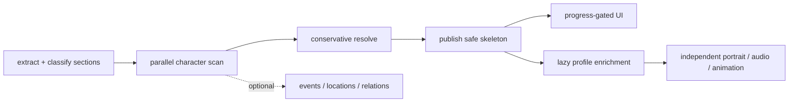

# Разметка книг: соответствие текущему UI и аудит сложности

- Дата среза: 17 августа 2026 года.
- Контекст: `book-analysis-v18` → `book-markup-v3` и текущий Expo-клиент.

## Короткий вывод

Разметка **переусложнена по ширине предметной модели, но не по требованиям к надёжности**.

- Модель данных примерно в 2–3 раза шире текущего продукта: UI использует персонажей, тогда как
  pipeline на равных извлекает ещё события, локации, отношения и предусматривает сюжетные арки.
- Операционная схема примерно в 1,5–2 раза сложнее минимально необходимой для нынешнего масштаба:
  шесть stage services, отдельные artifacts/snapshots/publications и обязательный profile job для
  каждого confirmed character.
- Exact evidence, offsets, idempotency, immutable publication, anti-spoiler gating и независимые media
  jobs — не лишняя сложность. Они защищают ключевой UX от спойлеров, перепутанных персонажей,
  повторной оплаты генерации и частичных падений провайдеров.

Иными словами: сокращать стоит количество извлекаемых сущностей, blocking stages и eager enrichment,
а не доказательность и контроль публикации.

## Что фактически показывает и использует UI

| Поверхность | Что видит пользователь | Нужные данные |
|---|---|---|
| Список персонажей | Нарра, имя героя, роль, аватар, статус подготовки | stable ID, имя, role, portrait, media state, first appearance |
| Processing state | прогресс `готово chunks / всего`, provisional names | stage/chunk counts, provisional identity, first evidence |
| Карточка героя | портрет/idle, имя, «Био», «Характер», голос | name, role, traits, portrait, animation, greeting/audio, voice |
| Чат с героем | поведение и стиль ответа без спойлеров | full name, role, traits, speech style, reader progress, greeting |
| Reader | открытие героя и подсветка упоминаний | name, aliases, stable ID, first appearance |
| Генерация сцены | узнаваемый герой внутри сцены | name, role, gender, grounded appearance |
| TTS диалогов | выбор голоса и speaker matching | name, aliases, gender/voice, speech attribution |

В текущем UI нет экранов для events, locations, relationships, story arcs или evidence. Эти данные не
входят в мобильную `NarraCharacter`-проекцию и не улучшают текущую карточку напрямую.

### Поля по продуктовой критичности

Обязательные для безопасного минимального skeleton:

- `characterKey`, canonical name, aliases;
- точный `firstAppearanceTextOffset`;
- короткий role/description, даже с явно указанной низкой доказательностью;
- факты возраста, пола и внешности, если они используются в портрете или сцене.

Можно догружать асинхронно:

- traits/personality;
- speech style и examples;
- greeting и voice tuning;
- portrait, audio, animation.

Не нужны текущему UI:

- общий каталог событий;
- общий каталог локаций;
- граф отношений;
- story arcs;
- публикация сырых evidence на устройство.

Evidence для обязательных полей всё равно нужно хранить на backend — для QA, повторного synthesis и
предотвращения ошибок вида «ребёнок изображён взрослым».

## Где система оправданно сложна

### Полный проход по книге

Нельзя надёжно определить первое появление, алиасы и одноимённых персонажей только по первым главам.
Полный scan нужен. Параллельные bounded chunks нужны, чтобы большая книга не помещалась в один prompt
и анализ не занимал последовательно десятки минут.

### Точные evidence и offsets

Это основа anti-spoiler unlock, reader name matching, диагностики и безопасной генерации внешности.
Без exact slice validation LLM может вернуть правдоподобную, но отсутствующую в книге цитату.

### Immutable snapshot и validator

Resolver должен работать над одним полным набором observations, а validator — доказать, что markup
собран именно из него. Иначе параллельные retries способны смешать версии. Предыдущая хорошая
publication должна оставаться доступной, пока новая не прошла проверки.

### Durable и независимые jobs

LLM, image и TTS providers медленные и нестабильные. Lease, retry и idempotency предотвращают
зависшие jobs и повторные расходы. Разделение portrait/audio/animation оправданно: отказ видео не
должен блокировать портрет и голос.

### Приватность личных книг

Изоляция по subject, hash verification и TTL обязательны. Упрощение здесь не должно означать общий
кэш приватного текста или бессрочное хранение.

## Где переусложнили

### 1. Размечаем доменную модель, которой пока нет в продукте

Scan тратит tokens и внимание модели на 12 observation types. Затем resolver, snapshot, assembler и
validator поддерживают четыре типа entities, хотя экрану нужен прежде всего character graph.
`storyArcs` уже входят в публичную схему, но всегда пусты.

Цена — более тяжёлые prompts, больше конфликтующих candidates, сложнее validator и больше точек
отказа без пользовательской ценности сегодня.

**Упрощение:** оставить events/locations/relationships необязательным enrichment channel, который не
блокирует `CharacterMarkup`. Не удалять таблицы сразу; перестать требовать и обрабатывать эти типы в
обычном reader-run, пока не появится конкретный UI.

### 2. Финальный профиль блокирует публикацию skeleton

Сейчас для каждого из максимум 128 confirmed characters обязателен отдельный synthesis job, а
assembly ждёт все профили. Один редкий персонаж или плохой provider response задерживает весь roster.
Пользователю при этом сначала нужны имя, точка появления и несколько безопасных полей.

**Упрощение:** публиковать `CharacterSkeleton` сразу после conservative resolve. Enrichment выполнять
пакетно для главных 10–20 персонажей, а остальных — лениво перед warmup frontier. Пустой traits не
должен блокировать identity/unlock.

### 3. Шесть процессов отражают внутренние функции слишком буквально

Логические границы полезны, но отдельный deployment для prepare, resolve, validate и publish при
небольшом каталоге даёт больше контейнеров, health/debug поверхности и координации, чем throughput.

**Упрощение:** сохранить durable stage machine в БД, но обслуживать её четырьмя worker pools:

1. prepare;
2. parallel scan;
3. resolve + profile enrichment;
4. finalize: assemble + pure validation + atomic publish.

Validator как код остаётся независимым; ему не обязательно быть отдельным постоянно работающим
сервисом.

### 4. Provisional UI не соответствует порядку готовности scan

Scan chunks выполняются по всей книге параллельно. Поэтому «21 персонаж уже найден» не означает
реальный прогресс чтения первой части: поздняя глава или список героев в предисловии может завершиться
раньше narrative beginning. Это объясняет ранний избыток персонажей в *Pride and Prejudice*.

**Упрощение:** до классификации front matter показывать общий прогресс, но provisional characters
публиковать только после минимального identity resolve и narrative evidence. Ещё лучше — ранний
skeleton для уже прочитанного диапазона, а не сырые candidates случайно завершившихся chunks.

### 5. Fixed 75% coverage — дорогой косвенный сигнал

Полосы по 4 000 символов ловят ответ модели только по началу огромного prompt, но не доказывают
полноту персонажей. В главах без персонажей отсутствие observation нормально, а front matter может,
наоборот, создать ложное покрытие.

**Упрощение:** считать техническое покрытие по успешно обработанным cores, а semantic gate — по
narrative sections и качеству character evidence. Fixed-band эвристику оставить диагностикой или
fallback, не единственным глобальным барьером.

### 6. Сохранились две эпохи архитектуры

В коде всё ещё есть v2/local markup API, мобильный `character-analysis.ts`, client media fallback и
поля совместимости. Актуальный coordinator уже использует backend v3, но legacy surface усложняет
понимание и тестирование.

**Упрощение:** определить минимальную поддерживаемую версию клиента и после её окна удалить запись
`local-markup`, локальную авторазметку для поддерживаемых форматов и v2 reader fallback. Offline режим
при необходимости оформить отдельным явно ограниченным продуктовым режимом.

### 7. Reader ждёт «полный bundle», хотя jobs уже независимы

Backend умеет генерировать три assets независимо, но мобильная материализация помечает персонажа
ready лишь после загрузки portrait, audio и animation. Пользователь может ждать FFmpeg/TTS, хотя
портрет уже готов.

**Упрощение:** хранить состояния `portraitState`, `audioState`, `animationState`; показывать карточку с
первым готовым asset. Полная bundle readiness остаётся агрегированной метрикой, а не UI-барьером.

## Где перезаложились на будущее удачно

- Versioned immutable publications позволяют безопасно сравнивать v18/v19 и откатываться.
- Универсальный observation/evidence слой пригоден для будущих цитат, карты отношений и timeline.
- Section-aware offsets подготовлены для разных EPUB/FB2 reader coordinate systems.
- Независимые worker pools масштабируются под массовую загрузку каталога.
- Раздельная media revision позволяет менять визуальную политику без повторного NLP-анализа.
- Shadow publication подходит для offline audit и A/B качества до смены reader projection.

Эти элементы стоит сохранить, но не обязательно включать каждый enrichment в blocking critical path.

## Где перезаложились на будущее преждевременно

- лимиты до 128 персонажей и 2 048 сущностей каждого вида при UI, рассчитанном на небольшой roster;
- обязательный profile job для каждого подтверждённого персонажа;
- events/locations/relationships как равноправная часть первой production publication;
- `storyArcs` в контракте до появления producer и consumer;
- отдельный постоянно работающий сервис на каждую короткую детерминированную финальную стадию;
- provisional roster до решения front matter и conservative identity.

Это не требует срочной миграции БД. Достаточно сузить default execution path и оставить расширенные
таблицы как совместимый резерв.

## Рекомендуемая целевая схема с минимальными изменениями



Минимальная практическая последовательность:

1. сначала классифицировать front/narrative/back matter;
2. scan по умолчанию сфокусировать на character identity, aliases, first appearance, dialogue и
   критических portrait constraints;
3. сделать resolver консервативным: совпадение имени — кандидат на merge, а не безусловное равенство;
4. публиковать skeleton независимо от traits/speech/media;
5. enrich главных и приближающихся к читателю персонажей;
6. делать events/locations/relationships асинхронным необязательным слоем;
7. отдавать каждый media asset независимо по мере готовности.

## Personality: почему пусто и что делать

В v3 нет отдельного first-class поля `personality`; UI показывает `traits`. Они часто пусты не потому,
что нечего написать, а потому что строгая схема принимает trait только из `character_trait`, action
или dialogue evidence, а устойчивую черту — из прямого утверждения либо повторяемого поведения.
Однократное слабое наблюдение намеренно не проходит.

Для текущего UX разумнее вернуть хоть полезную гипотезу, но не выдавать её за установленный факт:

```json
{
  "value": "решительный",
  "evidenceStatus": "insufficient",
  "confidence": 0.42,
  "evidenceIds": ["..."]
}
```

UI может показать значение с неброской пометкой «предварительно» вместо прочерка. Grounded traits
остаются строгими. Это изменение нужно проектировать отдельно: текущую evidence-схему personality,
`character_trait` и `appearance` в рамках этой ветки не перерабатываем.

## Приоритет упрощений

| Приоритет | Изменение | Эффект | Риск |
|---|---|---|---|
| P0 | front/narrative classification | меньше ложных ранних героев и unlock | низкий |
| P0 | age/role/gender как обязательные constraints портрета | меньше катастрофических media-ошибок | низкий |
| P0 | не считать точное имя достаточным для merge | исправляет омонимов | средний |
| P1 | skeleton publication до полного enrichment | заметно быстрее первый полезный результат | средний |
| P1 | независимая готовность media в клиенте | портрет/голос появляются раньше | низкий–средний |
| P1 | ограничить eager synthesis top 10–20 | ниже latency и стоимость | средний |
| P2 | optional events/locations/relationships | проще prompts и validation path | средний |
| P2 | объединить финальные worker pools | проще эксплуатация | низкий |
| P3 | удалить v2/local compatibility после окна клиентов | меньше кодовой поверхности | миграционный |

## Итоговая оценка

Если цель ближайшего релиза — «читатель встречает героя, видит правдоподобный портрет и может с ним
поговорить», то около половины текущей предметной модели не участвует в результате. Однако примерно
треть кажущейся сложности — это не будущие функции, а необходимая production-надежность.

Рациональная стратегия — не переписывать pipeline заново. Нужно сохранить ingestion, exact evidence,
durable jobs, immutable publication и progress gating, но сделать критический путь character-only,
публиковать skeleton раньше и вынести остальное в ленивое enrichment. Это уменьшит наблюдаемую
сложность и latency примерно вдвое без отказа от уже построенного фундамента.
